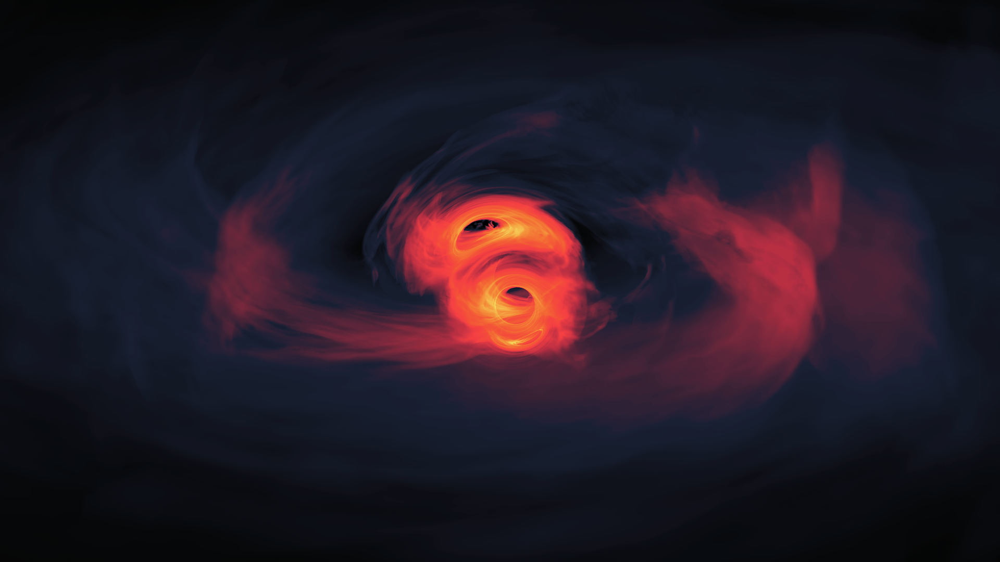

# My desktop wallpaper for workstation

> These two black holes are just 40 orbits away from merging in this simulation of the light their environment emits as they dance.

- Credit: Credit: NASA's Goddard Space Flight Center/Scott Noble; simulation data, d'Ascoli et al. 2018
- Orginial by NASA - https://svs.gsfc.nasa.gov/14146/
- Modfied by Camina Shell 2025

Three sizes:

- `1920 x 1080` [SupermassiveBinaryBlackHoles_recolored-1920x1080-FHD](./archives/SupermassiveBinaryBlackHoles_recolored-1920x1080-FHD.zip) (FHD) 623Kb 
- `3840 x 2160` [SupermassiveBinaryBlackHoles_recolored-3840x2160-4K](./archives/SupermassiveBinaryBlackHoles_recolored-3840x2160-4K.zip) (4K) 5.8Mb
- `7680 x 4320` [SupermassiveBinaryBlackHoles_recolored-7680x4320-8K](./archives/SupermassiveBinaryBlackHoles_recolored-7680x4320-8K.zip) (8K) 31Mb
